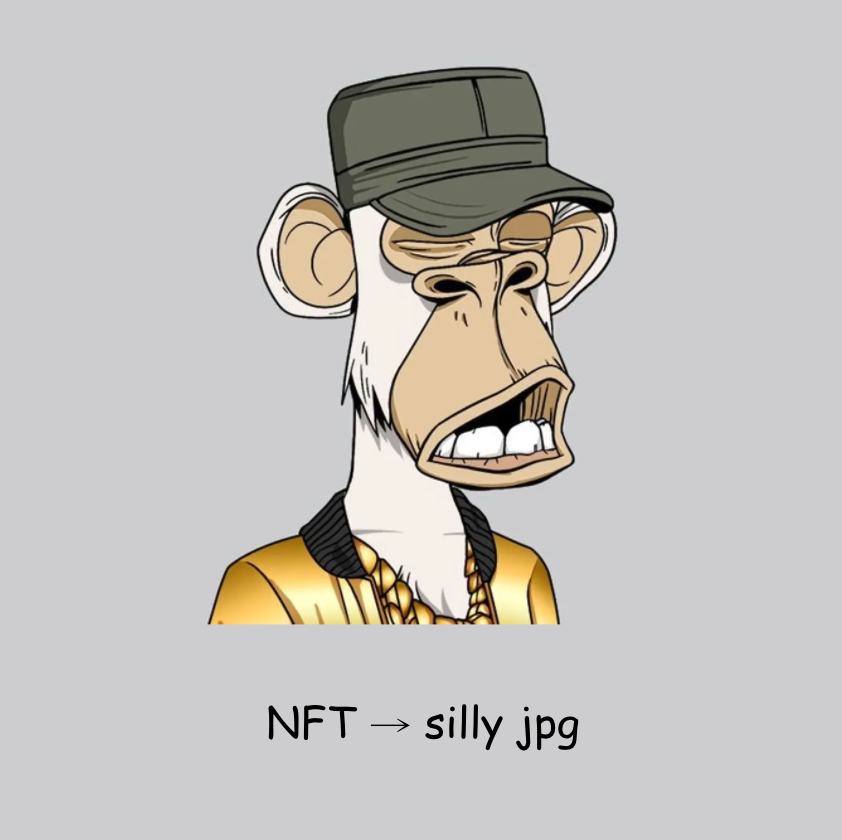

'NFT' to 'silly jpg'
=============

Chrome extension that replaces all occurrences of 'NFT' with 'silly jpg'.

Forked from PanicSteve's [cloud-to-butt](https://github.com/panicsteve/cloud-to-butt/)

Installation
------------

Manual: In Chrome, choose Window > Extensions.  Drag NFTtoSillyJPG into the page that appears.
Chrome Web Store